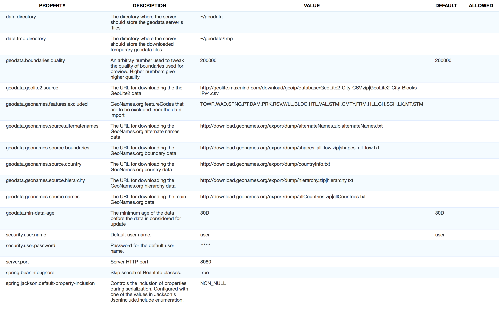

Spring-Actuator-Config
======================

[](http://repo1.maven.org/maven2/com/ethlo/spring/spring-actuator-config)
[](LICENSE)
[](https://travis-ci.org/ethlo/spring-actuator-addons)

Endpoint that returns the configuration properties along with the [Spring meta-data](https://docs.spring.io/spring-boot/docs/current/reference/html/configuration-metadata.html) to get nice descriptions and hints about the application's configuration parameters.

## How to use

Include the dependency:

```xml
<dependency>
  <groupId>com.ethlo.spring</groupId>
  <artifactId>spring-actuator-config</artifactId>
  <version>1.5.0</version>
</dependency>
```

Activate the actuator end-point:

```java
@Bean
public ConfigurationPropertiesEndpoint configEndpoint()
{
  // Make available under /<management.context-path>/config
  return new ConfigurationPropertiesEndpoint("config");
}
```
* https://docs.spring.io/spring-boot/docs/current/reference/html/production-ready-monitoring.html#production-ready-customizing-management-server-context-path

## Example data
The following example data and screenshots are from the [geodata project](https://github.com/ethlo/geodata)

### Raw JSON data from actuator


### Data as displayed in IDE (Spring STS)


### Data as displayed in custom (very simple) web UI


This very [simple web-ui can be grabbed from here](doc/sample/config.html) and added as a static resource in your project as a starting point.
